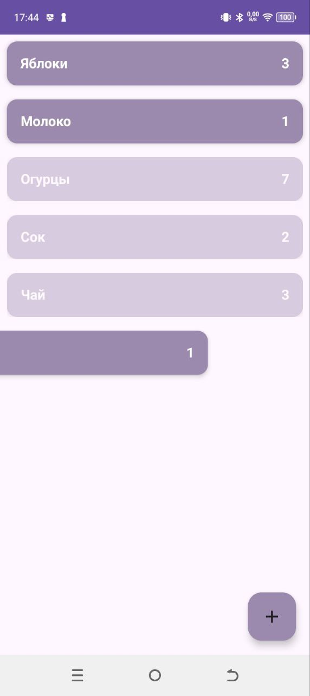

# Shopping List Android App

## Описание

Приложение для добавления/удаления списка покупок. 

Приложение реализовано с соблюдением принципов архитектуры MVI с разделением на слои `presentation`, `domain`, `data`. Используется современный стек Android-разработки с фокусом на модульность, читаемость и тестируемость кода.

Актуальный код в ветке **develop**.

---

## Функциональные возможности

### Общие:
- Добавление элемента в список
- Удаление элемента из списка свайпом
  
---

## Технологии

### Архитектура и принципы:
- MVI
- Clean Architecture (presentation/domain/data)
- Dependency Injection: Hilt
- Kotlin Сoroutines, Flow

### UI и навигация:
- Jetpack Compose
- RecyclerView

### Сетевой и локальный доступ:
- Room (локальная БД)
---
## Скриншоты

### Главная и добавление элемента

  
  

---

## Лицензия

Этот проект распространяется под лицензией MIT.
